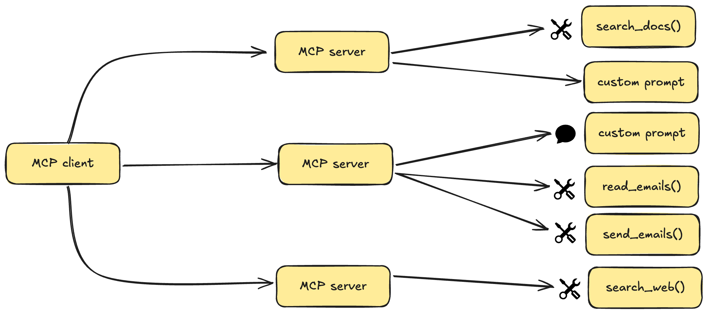

# MCP 服务器示例

本项目基于 [alejandro-ao/mcp-server-example](https://github.com/alejandro-ao/mcp-server-example) 修改，感谢原作者的贡献。

本仓库包含一个用于教育目的的模型上下文协议(MCP)服务器实现。该代码演示了如何构建一个可以与各种LLM客户端集成的功能性MCP服务器。

完整教程请参考[YouTube视频教程](https://youtu.be/Ek8JHgZtmcI)。

## 什么是MCP？

MCP(模型上下文协议)是一个开放协议，标准化了应用程序如何向LLM提供上下文。可以将MCP视为AI应用的USB-C接口 - 它提供了一种标准化的方式将AI模型连接到不同的数据源和工具。



### 主要优势

- 不断增长的预构建集成列表，您的LLM可以直接接入
- 灵活切换不同LLM提供商和供应商
- 在您的基础设施内保护数据的最佳实践

## 架构概述

MCP遵循客户端-服务器架构，主机应用可以连接到多个服务器：

- **MCP主机**：如Claude桌面版、IDE或希望通过MCP访问数据的AI工具
- **MCP客户端**：与服务器保持1:1连接的协议客户端
- **MCP服务器**：通过标准化的模型上下文协议暴露特定功能的轻量级程序
- **数据源**：MCP服务器可以访问的本地(文件、数据库)和远程服务(API)

## 核心MCP概念

MCP服务器可以提供三种主要类型的功能：

- **资源**：客户端可以读取的类文件数据(如API响应或文件内容)
- **工具**：LLM可以调用的函数(需用户批准)
- **提示**：帮助用户完成特定任务的预写模板

## 系统要求

- Python 3.10或更高版本
- MCP SDK 1.2.0或更高版本
- `uv`包管理器

## 新增功能

- 使用YAML格式的配置文件(config.yml)
- 集成的日志系统，支持：
  - 终端和文件输出
  - 按天轮转日志文件
  - 可配置的日志保留天数
  - 多级别日志记录(DEBUG, INFO, WARNING等)

## 快速开始

### 安装uv包管理器

在MacOS/Linux上：
```bash
curl -LsSf https://astral.sh/uv/install.sh | sh
```

安装后请重启终端以确保`uv`命令可用。

### 项目设置

1. 创建并初始化项目：
```bash
# 为项目创建新目录
uv init mcp-server
cd mcp-server

# 创建虚拟环境并激活
uv venv
source .venv/bin/activate  # Windows上使用: .venv\Scripts\activate

# 安装依赖
uv add "mcp[cli]" httpx pyyaml
```

2. 创建服务器实现文件：
```bash
touch main.py
```

### 运行服务器

1. 启动MCP服务器：
```bash
uv run main.py
```

2. 服务器将启动并准备接受连接

## 连接到Claude桌面版

1. 从官方网站安装Claude桌面版
2. 配置Claude桌面版使用您的MCP服务器：

编辑`~/Library/Application Support/Claude/claude_desktop_config.json`：
```json
{
    "mcpServers": {
        "mcp-server": {
            "command": "uv",  # 最好使用uv命令的绝对路径
            "args": [
                "--directory",
                "/ABSOLUTE/PATH/TO/YOUR/mcp-server",
                "run",
                "main.py"
            ]
        }
    }
}
```

3. 重启Claude桌面版

## 故障排除

如果Claude桌面版无法识别您的服务器：

1. 检查配置文件路径和权限
2. 验证配置中的绝对路径是否正确
3. 确保uv已正确安装并可访问
4. 检查Claude桌面版日志中的错误消息

## 许可证

本项目采用MIT许可证。详情请参阅[LICENSE](LICENSE)文件。
